$$\text{\huge \textbf{CS 276 - Course Review}}$$
$$\text{\Large Pattern Recognition and Machine Learning}$$

# Intro/Patterns
* In pattern recognition, a pattern can be anything perceived.
* **Generative Model** - model for randomly generating observable data values. A generative model is a full probablisitc model of all varaibles
* **Discriminative Model** - model dependence of an unobserved variable $y$ on an observed variable $x$. That is, given an observed $x$, it predicts an associated $y$.

* Differences between discriminative and generative models:
    * Generative is a full probablistic model of all variables; discriminative models provide a model for only the target variable(s) conditional on the observed data.
    * Generative models can be used to simulate values of any variable in the model; discriminative models only allow sampling the target variables conditional on the observed quantities.
    * Generative models capture the joint distribution between $x$ and $y$, but discriminative models can perform better when the joint distribution is not required.
    * Most discriminative models are supervised (since they try to determine $y$ based on $x$). 

1) Discriminative methods:
    * Models find the discriminative target without understanding the underlying pattern (structure) or develop a full mathematical description.
    * Aim to minimize a utility function (e.g. classification error)
    * Rely on large, label training data
    * Usefull when all we need is classification (do not need to generalize the algorithm)

2) Generative methods:
    * Bayesian school, pattern theory
    1) Define patterns and regularities
    2) Specify likelihood model for how signals are generated
    3) Learning probability models from collections of signals
    4) Interfences
    * Basic idea: build models for underlying patterns, and can learned, adapted, and generalized with data.

# Bayesian Decision Theory
* The basic framework for pattern recognition
* $y$ represents a belief about the current situation (e.g. a belief about what an observable $X$ is). We have a set of features, $x$, which describe $X$. We then take an $\alpha$ which is a decision based on our belief and the observable $X$.
* For the fish example: $X$ = image of the fish, $x$ = (brightness, length, # of fin, etc), $y$ is the belief what type of fish $X$ is ($\Omega^c =$ {"sea bass", "salmon", "trout"}), and $\alpha$ is the decision we make for the fish (in this case $\Omega^c = \Omega^\alpha$).

\newpage
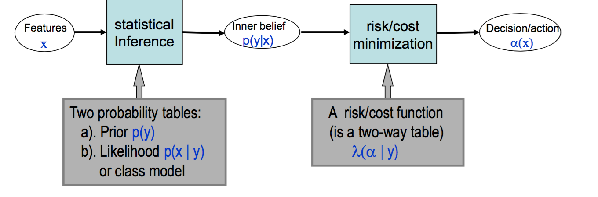{width=70% }

* The **inner belief** (Bayes' Rule) is given by:
$$ p(y|x) = \frac{p(x|y)p(y)}{p(x)} $$
where $p(y)$ is the **prior probability**, $p(x|y)$ is the **likelihood**.
* **Joint probability** is given by
$$ p(x,y) = p(y|x)p(x) $$
* The **expected risk** is computed with:
$$ R(\alpha_i|x) = \sum^{k}_{j=1}\lambda(\alpha_i|y=j)p(y=j|x) $$
where $\lambda(\alpha_i|y=j)$ is the **penalty** (usually a matrix) of taking action $\alpha_i$ when the true outcome is $y=j$ the $p(y=j|x)$ is the likelihood the true outcome is $y=j$ given data $x$.
* The optimal action minimizes conditional risk 

* A simple example: you a betting on which side a tossed coin will fall on. You win $1 if you are right and lose $1 if you are wrong. Let $x$ be whtever evidence that we observe. Together with some prior information about the coin, you believe the head has a 60% chance and tail 40%.
$$ y \in {H,T}, \alpha \in {H,T}, \lambda(\alpha(x)|y) = \alpha\left(\substack{-1 +1 \\ +1 -1}\right) $$
* $\lambda$ here represents a loss table (so if we guess correctly we have a negative loss)
$$ R(\alpha_i|x) = \alpha\left(\substack{-1 +1\\+1 -1}\right)\left(\substack{0.6\\0.4}\right)$$
$$ R(\alpha_i|x) = \alpha\left(\substack{-0.2 \\ 0.2}\right)$$
* so we choose $H$, which corresponds to a loss of $-0.2$
* A **decision rule** is a mapping function from the feature space to a set of actions ($\alpha(x): \Omega^d \rightarrow \Omega^\alpha$)
    * A decision is made to minimize the average (expected) cost (risk):
    $$ \alpha(x) = \text{arg}\underset{\Omega^\alpha}{\text{min}} R(\alpha|x)$$
* Special Case: 0-1 loss
    * Let $\lambda(\alpha|y) = 0$   if $\alpha = y$
    * Let $\lambda(\alpha|y) = 1$   if $\alpha \neq y$
    * The risk for classifying $x$ to class $\alpha = i$ is the probability of misclassification, which is given by:
    $$ R(\alpha=i|x) = \sum_{y \neq i} p(y|x) = 1 - p(y = i |x) = \lambda(\alpha|y=i)$$
    * The optimal decision to make is the class that has the maximum posterior probability
    $$ \alpha(x) = \text{arg}\underset{\Omega^\alpha}{\text{min}}(1 - p(\alpha|x)) = \text{arg}\underset{\Omega^\alpha}{\text{max}}(p(\alpha|x)) $$

## Discriminant Functions/Decision Boundaries
* **Discriminant Functions** are functions which describe a mathematical description of the optimal decision to make. That is, they divide a decision space into optimal decisions based on some empirical criteria (min loss, min risk, etc).
* Discriminant functions partition the feature space through a set of functions $\{g_1(x),...g_k(x)\}$
* The optimal decision is $\alpha(x) = \text{argmax}\{g_1(x),...g_k(x)\}$
* For Guassian distributions (see HW 1 problem 1), we have following proof:

    \textit{Proof} Let $p(x|w_i) \approx \mathcal{N}(\mu_i, \sigma^2I)$. Then
    $$
    \begin{aligned}
        g_i(x) &= \log p(x|y=i) + \log p(y=i) \\
               &= \frac{-1}{2\sigma^2}(-2\mu_i^Tx+\mu_i^T\mu_i) + \log p(y=i) \\ 
               &= \frac{1}{\sigma^2}\mu_i^Tx+\frac{-1}{2\sigma^2}\mu_i^T\mu_i+\log p(y=i) 
    \end{aligned} 
    $$

## Bayes Risk, Bayes Error
* **Bayes Risk** is the risk of the optimal decision ($\alpha$):
$$ 
    R(\alpha) = \int R(\alpha(x)|x)p(x)dx
              = \int \sum_{y=1}^k \lambda(\alpha(x)|y)p(y|x)p(x)dx
              = \int \sum_{y=1}^k \lambda(\alpha(x)|y)p(y,x)dx
$$
* We can estimate the Bayes risk (known as **empirical risk**) by summing all the risks (wrong decisions over the testing set)
$$ \text{Given } D = \{(x_i,y_i);i=1,2,...,m\} \text{   Bayes risk = } \frac{1}{m} R(\alpha) = \sum_{j=1}^{m}\lambda(\alpha(x_j)|y=j) $$
* The **Bayesian Decision Policy** minimizes loss $\pi = \text{argmin } R_\pi$ (always picks the action with the lowest risk).
     * For the case of 0/1 loss, the Bayesian decision policy will always choose the class with the highest posterior probability $p(y=i|x)$. Accordingly, the risk of this decision is $1-p(y=i|x)$

## ROC and PR Curves
* **ROC curves** plot of comparing the true positive rate (TPR, correctly labeled positive samples) against the false positive rate (FPR, incorrectly labeled negative samples)
$$ TPR = \frac{\text{\# true positives}}{\text{\# positives}} $$
$$ FPR = \frac{\text{\# false positives}}{\text{\# negatives}} $$
* The threshold is slide across the entire range of the distribution. A point on the curve is plotting using the FPR vs TPR (x,y) at a particular value of the threshold.
* **PR Curves** (precision-recall) plot the precision (measure of correctness) against a recall (measure of completeness). 
$$ \text{Precision} = \frac{\text{\# true positive}}{\text{\# true positive + \# false positive}} $$
$$ \text{Recall} = \frac{\text{\# true positive}}{\text{\# true positive + \# false negative}} $$
* The threshold is slide across the distribution the same was as in ROC curves, just computing different values

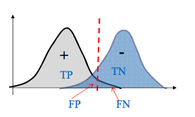{width=30%}

# Dimension Reduction Techniques
* **Dimension Reduction** reduces the complication of classification, but can result in worse classification
* Dimension reduction is only applicable to signals that can afford to lose data (since reducing the dimensionality is literally throwing away data)
    * white noise cannot be reduced - it is full of unique data (we need data which will separate after dimension reduction)
* Dimension reduction techniques can be classified in three axes:
    1) Generative (PCA) vs. discriminative (Fisher's linear discriminant)
    2) Linear (PCA, Fisher) vs. Non-linear (MDS)
    3) Global (porjection, e.g. PCA) vs. Local (nearest neighbor, e.g. LLE)

## Principle Component Analysis
* A generative method. Basic idea: reduces the data down to dimensions whose primary axis is in the direction of the greatest amount of variance (minimizing the variance when the data is projected onto this axis), then generate the data using these reduced dimensions.

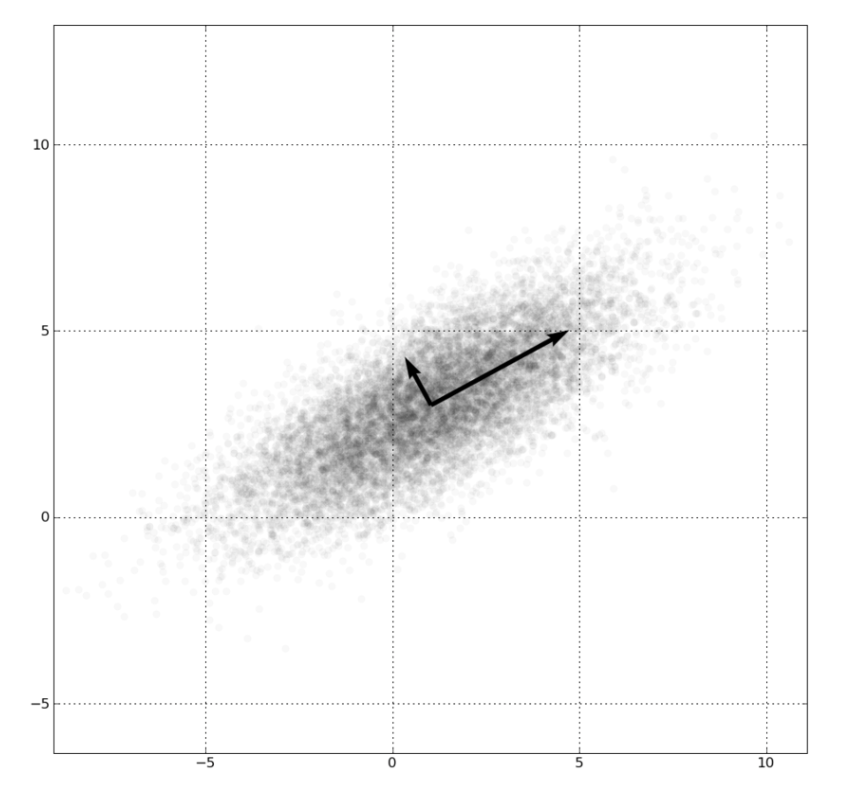{width=30%}

* Variance minimization: find $\boldsymbol{u}$ that minimizes the projected variance

$$ 
\begin{aligned}
    \text{variance} &= \frac{1}{N}  \sum_{n=1}^{N} \left( \boldsymbol{u}^T \boldsymbol{x_n} + \boldsymbol{u}^T \bar{\boldsymbol{x}} \right)
                    &= \boldsymbol{u}^T S \boldsymbol{u}
\end{aligned}
$$
where $S = \frac{1}{N}  \sum_{n=1}^{N} \left( \boldsymbol{x_n} - \bar{\boldsymbol{x}} \right)^T \left( \boldsymbol{x_n} - \bar{\boldsymbol{x}} \right)$. $S$ is called the scatter (covariance) matrix.

* **Goal**: find maximize variance ($\boldsymbol{u}^T S \boldsymbol{u}$) under the constraint $\boldsymbol{u}$ is a unit vector ($||\boldsymbol{u}|| = 1 \implies g(\boldsymbol{u}) = \boldsymbol{u}^T \boldsymbol{u} - 1$)
* We can use a Lagrange multiplier to solve for this constraint.
$$ 
\begin{aligned}
    L(\boldsymbol{u},\lambda) &= f(\boldsymbol{u}) - \lambda g(\boldsymbol{u}) \\
                              &= \boldsymbol{u}^T S \boldsymbol{u} - \lambda(\boldsymbol{u}^T \boldsymbol{u} - 1) \\
    \frac{\partial L}{\partial \boldsymbol{u}} &= S \boldsymbol{u} - \lambda \boldsymbol{u} = 0 \\
                              & \implies S \boldsymbol{u} = \lambda \boldsymbol{u}
\end{aligned}
$$
so $\boldsymbol{u}$ is an eigenvector of the covariance matrix $S$.

##Fisher Linear Discriminant
* In a two-class classification problem, given: $n$ samples $\text{x}_1,...\text{x}_n$ in a $d$-dimensional feature space, $n_1$ in subset $X_1$ with label $w_1$ and $n_2$ in subset $X_2$ labeled $w_2$.
* Goal: find a vector $w$ and project the $n$ samples on this axis:
$$ \text{\textbf{y}} = w^T \text{\textbf{x}} = \langle w, \text{\textbf{x}} \rangle $$
such that the projected samples are well separated.
    * Find a line to project data onto that class separation
    $$ \text{\textbf{y}} = w^T\text{\textbf{x}} $$
    * This projects $\text{\textbf{x}}$ onto $w$.

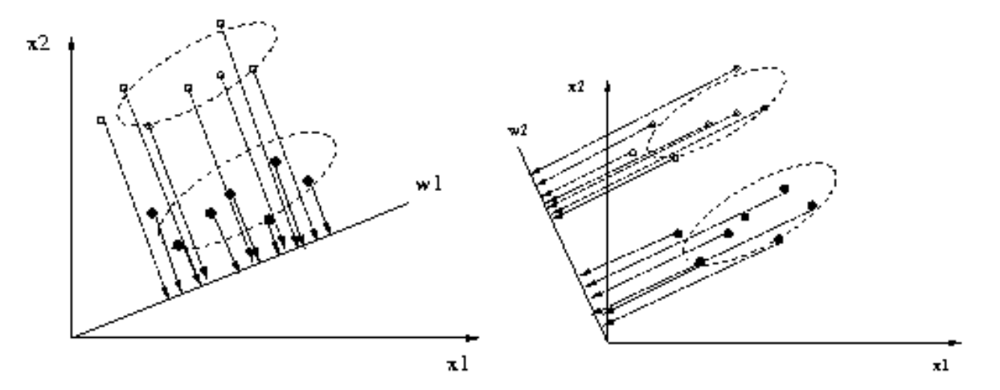{width=50%}

* **Sample mean** for class $w_i$:
$$ \text{\textbf{m}}_i = \frac{1}{n_i} \sum_{x \in X_i} \text{\textbf{x}},~~~~i = 1, 2 $$
* **Scatter matrix** for class $w_i$:
$$ \text{S}_i = \sum_{x \in X_i} (\text{\textbf{x}} - \text{\textbf{m}}_i)(\text{\textbf{x}} - \text{\textbf{m}}_i)^T~~~~i = 1, 2 $$
* The **between class scatter matrix**:
$$ \text{S}_B = (\text{\textbf{m}}_1 - \text{\textbf{m}}_2) (\text{\textbf{m}}_1 - \text{\textbf{m}}_2)^T $$
* The **within-class scatter matrix**:
$$ \text{S}_W = \text{S}_1 + \text{S}_2 $$
* The **sample mean** of the projected points in class $w_i$:
$$ \tilde{m_i} = \frac{1}{n_i} \sum_{x \in X_i} w^T \text{\textbf{x}} = w^T\text{\textbf{m}}_i,~~~~~ i = 1,2 $$
* The **scatter** of the projecte points in class $w_i$:
$$ \tilde{s_i} = \sum_{x \in X_i} (w^T\text{\textbf{x}} - w^T \text{\textbf{m}}_i)^2 = w^T\text{S}_iw, ~~~~~ i = 1,2 $$
* The sample mean and the scatter are 1-dimensional variables

* Fisher's linear discriminant $y = w^T\text{\textbf{x}}$: choose $w$ to maximize
$$ J(w) = \frac{|\tilde{m_1} - \tilde{m_2}|^2}{\tilde{s_1}^2 + \tilde{s_2}^2} = \frac{w^T\text{S}_Bw}{w^T\text{S}_Ww} $$
i.e. the between class distance should be as large as possible, and the within class scatter should be as small as possible (known as the **Rayleigh quotient**).
* The Rayleigh coefficient means a vector $w$ which minimizes $J$ satisfies the generalized eigenvalue problem:
$$ S_B w = \lambda S_W w $$
* Note that $\text{S}_B$ is always in the direction of $\text{\textbf{m}}_1-\text{\textbf{m}}_2$, the solution can be written as:
$$ w = \text{S}_W^{-1} (\text{\textbf{m}}_1 - \text{\textbf{m}}_2) $$

## Multiple Discriminant Analysis
* For a $c$-class problem, we can generalize the scatter matrices.
* The within-class scatter matrix becomes:
$$ \text{S}_W = \text{S}_1 + \text{S}_2 + ... + \text{S}_{c-1} $$ 
where $\text{S}_i$ is the scatter matrix computed from samples inside class $w_i$.
* The between-class scatter matrix becomes:
$$ \text{S}_B = \text{S}_{total} - \text{S}_W = \sum_{i=1}^{c} n_i(\text{\textbf{m}}_i - \text{\textbf{m}})(\text{\textbf{m}}_i - \text{\textbf{m}})^T $$
where $\text{S}_{total}$ is the total scatter matrix computed from all samples.
* We want vectors $w_i,i = 1, 2, ..., c-1$, and project the samples from $d$-dimensional feature space $x = (x_1, x_2, ..., x_d)$ to the $c-1$ dimensional space $\text{\textbf{y}} = (y_1, y_2, ..., y_{c-1})$.
$$ \text{\textbf{y}} = (w_1^T\text{\textbf{x}}, ..., w_{c-1}^T\text{\textbf{x}}) = W^T\text{\textbf{x}}$$
where $W$ is a $(c-1)xd$ matrix with $w_i$ being the $i$-th column. 
* The criterion for the optimal $W$ is (Note: the bars indicate a determinant)
$$ J(W) = \frac{|W^T\text{S}_BW|}{|W^T\text{S}_WW|} $$

## Multi-dimenstional Scaling (MDS)
* Objective: project data points into 1, 2, or 3-dimensional spaces so that the spatial distance of these data points are preserved.
* MDS is used for two purposes:
    1) Visual the structures and properties of data, so that we may select proper models for them.
    2) Verify some distance (metric) measure on an unknown data set.
* With a good distance measure, data should correspond to a "meaningful" cluster.
* Given: a set of data points in $d$ space $\{x_1, ..., x_n\}$ and a dissimilarity/distance measure/metric between two points $x_i,~x_j:~\delta_{ij}$.
* Objective: find points in 1, 2, or 3-space $\{y_1,...y_n\}$ with usually Eclidean distances $d_{ij}$ for two points $y_i$ and $y_j$.
* One criterion: stress
$$ \text{Stress} = \frac{\sum_{i,j}(d_{ij}-\delta_{ij})^2}{\sum_{i,j} \delta_{ij}^2} $$
and minimize the total pair-wise stress between each point

## Local Linear Embedding (LLE)
* A generative, non-linear, and local technique for dimension reduction

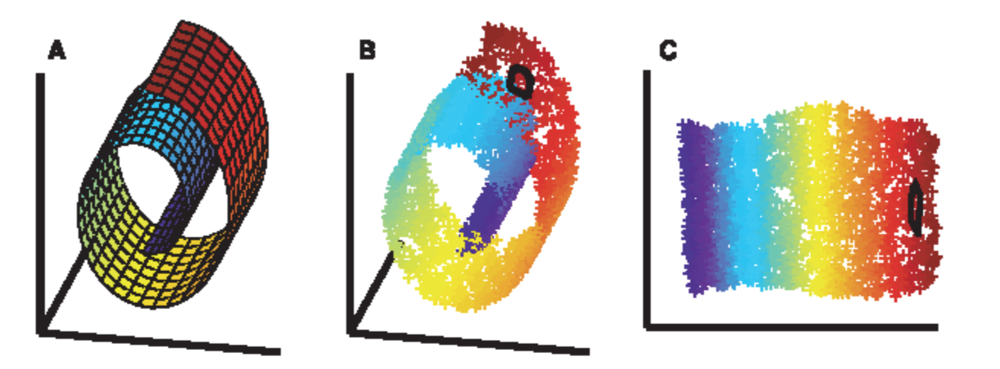{width=70%}

* Objective: use the neighborhood of points to build a reconstructive basis
* LLE algorithm:
    1) Compute the neighbors of each data point, $\vec{X}_i$
    2) Compute weights $W_{ij}$ that best reconstruct each data point $\vec{X}_i$ from its neighbors, minimizing the cost according to:
    $$ \epsilon(W) = \sum_i| X_i \sum_j W_{ij}X_j|^2 $$
    Such that $\sum_{ij} W_{ij}= 1$. Thus $\epsilon$ gives you the squared difference between the data points and their reconstructions.
    3) Compute the vectors $Y_i$ best reconstructed by the weights $W_{ij}$, minimizing the quadratic equation:
    $$ \phi(Y) = \sum_i | \vec{Y_i} - \sum_j W_{ij} \vec{Y_j} |^2 $$

# Boosting
* Technique for combining a number of "weak" classifiers to make a "strong" classifier.
* Several versions: Adaboost, RealBoost, LogitBoost - each optimizes a different design of loss functions.
* Basic idea: adds a hidden layer of nuerons one by one until the classification error on the training images goes to zero, by sequentially minimizing the upper-bound of the empirical error.
* For every type of boosting we have:
    1) A set of labeled training data from 2 classes:
    $$ \Omega = \{(x_i, y_i): x_i \in \Omega^d, y_i \in \{-1,1\},~i = 1,..., m \} $$
    2) A set of weak classifiers, a pool constructed for a task 
    $$ \Delta = \{h_t(x): t = 1,...,T\} $$
    $$ h_t(x): \Omega^d \rightarrow \{-1,1\} $$
* Basic idea pt. 2: Suppose we have two weak classifiers $h_1$ and $h_2$ which have 49% error each (slightly better than random chance), can we combine them to make a new classifier so that the error becomes lower? If so, we can repeat this process to make the error zero.

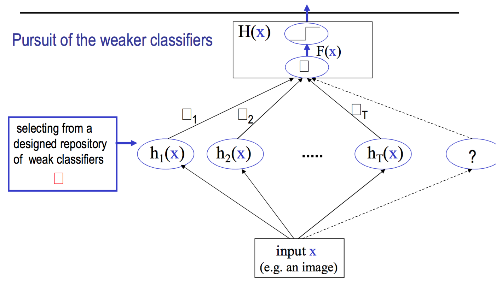{width=70%}

* The error rate of a weak classifier $h$ is calculated with:
$$ \epsilon(h) = \frac{1}{m} \sum_{i=1}^{m} 1(h(x_i) \neq y_i) < \frac{1}{2} $$
 where 1() is an indicator function (equals 1 if the condition is true, 0 otherwise).

* A **weak classifier** works better than random chance. For binary classifiers, it has less than 50% errors. If the error is larger than 50%, we flip the sign of the classifier to make the error less than 50%. We just cannot have classifiers with exactly 50% error (they provide no insight/additional information).
* The **strong classifier** is a linear combination of the weak classifiers:
$$ H(x) = \text{sign}\{\alpha_1 h_1(x) + ... + \alpha_T h_T(x) \} = \text{sign}\{F(x)\} $$
* Objective: choose $h = (h_1,...h_t)$ and $\alpha = (\alpha_1, ..., \alpha_T)$ to minimize the empirical error:
$$ Err(H) = \frac{1}{m} \sum_{i=1}^{m} 1(H(x_i) \neq y_i) $$

## Adaboost
* Characteristics of Adaboost:
    1) AdaBoost is a *sequential algorithm* that minimizes an upper bound of the classification error $Err(H)$ by selecting *weak classifiers* $h$ and their *weights* $\alpha$ one-by-one (a pursuit). Each time, a weak classifier is selected to maximally reduce the upper bound of error.
    2) AdaBoost assigns *weights to the data samples*. The weights are summed to one (that is, they are normalized with each round of boosting). These weights are updated when a new weak classifier $h_t$ is added. Data samples that are misclassified by $h_t$ are given more weight so that they recieve more "attention" in selecting the next weak classifier (because the weights are normalized to 1, this means the correctly classified data samples are given less "attention" in selecting the next weak classifier).
    3) Each step, a new weak classifier is selected to minimize the weighted error, so pays greater attention to misclassified samples.
    4) The empirical error will converge to zero at an exponential rate.
* The basic Adaboost algorithm:
    0) Initialize the data with uniform weight $\rightarrow D_0 = \frac{1}{m},~\forall X_i \in \Omega$. Set t = 0.
    1) At step t, compute the weighted error for each weak classifier
    $$ \epsilon(h) = \sum_{i=1}^m D_t(x_i)1(h(x_i) \neq y_i),~\forall h \in \Delta $$
    2) Choose a new weak classifier which has the least weighted error:
    $$ h_t = \text{arg}\underset{h\in \Delta}{\text{min}}~\epsilon_t(h) $$
    3) Assign a weight for the new classifier:
    $$ \alpha_t = \frac{1}{2} \log \frac{1-\epsilon_t(h_t)}{\epsilon_t(h_t)} $$
    4) Update the weights of the data points:
    $$ D_t(X_i) = \frac{1}{Z_t} D_{t-1}(X_i)e^{-y_i\alpha_t h_t(X_i)} $$

    Set t+1 $\rightarrow$ t, repeat steps 1-4 until three conditions: (1) training error of $H(x)$ is below a threshold, or becomes zero; (2) all the remaining weak classifiers have error close to 0.5 and thus are redundant; (3) a maximum number of weak classifier T is reached.

* Facts about the weights:
    1) The weight of the new classifier is always positive.
        * The smaller classification error, and bigger weight, and strong "voice" in the strong classifier.
    2) The weights of the data points are multiplied by:
    $$ \text{exp}\{-y_i\alpha_t h_t(X_i)\} = \left( \substack{e^{-\alpha_t} < 1 ~~\text{ if } h_t(x_i) = y_i \\ e^{\alpha_t} > 1 ~~\text{ if } h_t(x_i) \neq y_i} \right) $$
    * The weights of incorrectly classified data points increase, and the weights of the correctly classified data points decreases. So the incorrectly classified data points recieve more "attention" in the next run.

* $Z_t$ in the computation of $D_t$ is defined as:
$$ 
\begin{aligned}
    Z_t(\alpha_t,h_t) &= \sum_{x_i} D_{t-1}(x_i) \text{exp}(-y_iF(x_i)) \\
        &= \sum_{x_i \in A} D_{t-1}(x_i) \text{exp}(-\alpha_t) + \sum_{x_i \notin A} D_{t-1}(x_i) \text{exp}(\alpha_t)
\end{aligned}
$$
where $A$ is the set of correctly classified examples.
    * This means $Z_t$ is a function of $\alpha_t$.
* Since by definition $\sum_i D_t(x_i) = 1$, the data weights can be computed recursively:
$$ 
\begin{aligned}
    \sum_{i=1}^{m} D_{t+1}(x_i) &= \frac{1}{Z_t} \sum_{i=1}^{m} D_t(x_i) \text{exp}(-y_i \alpha_i h_t(x_i)) = 1 \\
                 &= \frac{1}{Z_t Z_{t-1} ... Z_{1}} \frac{1}{m} \sum_{i=1}^{m}\text{exp}(-y_i F(x_i)) = 1
\end{aligned}
$$
Therefore we have a constraint on $Z_{t+1}$ (note that this is the empirical loss function):
$$ Z_{t+1} = Z_t Z_{t-1} ... Z_{1} = \frac{1}{m} \sum_{i=1}^{m}\text{exp}(-y_i F(x_i)) $$

### Adaboost Convergence
* Conceptually: AdaBoost converges because we fix the portion of the algorithm created before step t (the current step). We also choose the weak classifier with the minimum error at each round of boosting, and the weight assigned in the final classifier is proportional to the error. Because the earlier weak classifiers are "stronger" classifiers than the current weak classifier and do not change, the current weak classifier is solely focused on "chipping away" the remaining error.
* To prove the convergence of AdaBoost, we want to show that as we add more learners, the overall loss decreases monotonically. We want to show that the empirical error is bounded from above by the exponential loss function:
$$ \left\{ \text{Err}(H) = \frac{1}{m} \sum_{i = 1}^{m}1(H(x_i) \neq y_i) \right\} \leq \left\{ Z = \frac{1}{m} \sum_{i=1}^{m} \text{exp}(-y_iF(x_i)) \right\} $$
where $Z$ is from the previous equation.
* AdaBoost is a greedy algorithm that minimizes the upper bound on the classification error,
$$ (h,\alpha)^* = \text{argmin}~Z(h,\alpha) $$
* In each step t, AdaBoost chooses the optimal $h_t$ and $\alpha_t$ to minimize $Z_t$
$$ (h_t,\alpha_t)^* = \text{argmin}~Z_t(h_t,\alpha_t) $$
* As $Z$ goes to zero, the classification error (over the training set) goes to zero. So it converges. Now minimize $Z$ as a function of $\alpha$. Take a partial derivative of $Z_t(\alpha_t,h_t)$ (formulated above):
$$ 
\begin{aligned}
    \frac{\partial Z_t(\alpha_t,h_t)}{\partial \alpha_t} &= \sum_{x_i \in A} -D_{t}(x_i) \text{exp}(-\alpha_t) + \sum_{x_i \notin A} D_{t}(x_i) \text{exp}(\alpha_t) = 0\\
    &\implies \sum_{x_i \in A} D_t(x_i) = \sum_{x_i \notin A}D_t(x_i)\text{exp}(2\alpha_t) 
\end{aligned}
$$
* We know the weighted error for each weak classifier is:
$$ \epsilon(h) = \sum_{i=1}^m D_t(x_i)1(h(x_i) \neq y_i) = \sum_{x_i \notin A} D_t(x_i), ~\forall h \in \Delta $$
* We can then solve for $\alpha_t$, knowing that $\sum_{x_i \in A} D_t(x_i) = 1 - \epsilon_t(h_t)$ (from above):
$$ 1 - \epsilon_t(h_t) = \text{exp}(2\alpha_t) \epsilon_t(h_t) $$
* Solving for $\alpha_t$:
$$ \alpha_t = \frac{1}{2} \log \frac{1 - \epsilon_t(h_t)}{\epsilon_t(h_t)} $$
* which is exactly what we have been using! Next, plug in $Z_t(\alpha_t, h_t)$ to get the minimum
$$
\begin{aligned}
    Z_t(\alpha_t,h_t) &= \sum_{x_i \in A} D_{t-1}(x_i) \text{exp}(-\alpha_t) + \sum_{x_i \notin A} D_{t-1}(x_i) \text{exp}(\alpha_t) \\ 
                      &= (1-\epsilon_t(h_t)) \sqrt{\frac{\epsilon_t(h_t)}{1-\epsilon_t(h_t)}} + \epsilon_t(h_t) \sqrt{\frac{1-\epsilon_t(h_t)}{\epsilon_t(h_t)}} \\
                      &= 2 \sqrt{\epsilon_t(h_t) (1-\epsilon_t(h_t))}
\end{aligned}
$$
* If we let $\gamma_t = \frac{1}{2} -\epsilon_t(h_t),~\gamma \in (0,\frac{1}{2}\rbrack$, the minimimum becomes:
$$ Z_t(\alpha_t,h_t) = 2 \sqrt{\epsilon_t(h_t) (1-\epsilon_t(h_t))} = \sqrt{1-4\gamma_t^2} \leq \text{exp}\left( -2\sum_{t=1}^{T}\gamma_t^2\right) $$
* Finally,
$$ \text{Err}(H) \leq Z \leq \text{exp}\left( -2\sum_{t=1}^{T}\gamma_t^2\right) $$

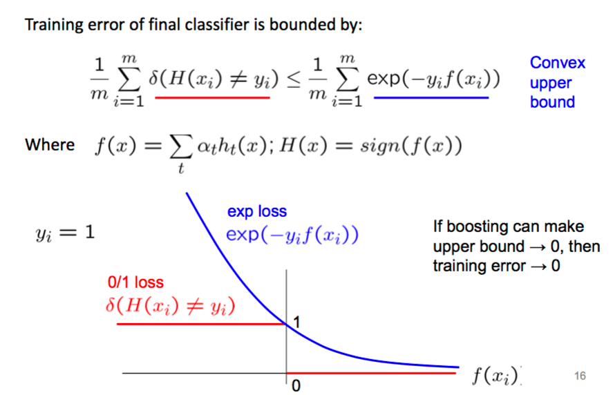{width=60%}

## RealBoost
* AdaBoost uses the sign of the final classifier, which is the weighted sum of the signs of each weak classifier. Because we are using a step function, we lose a lot of information (namely the distance of the point from the decision boundary). We can include a "confidence" of the classifier by using a number of bins on the step function to represent a confidence.
* We extend $h_t(x)$ to a more general form $h_t(x;\theta_t)$ with $\theta_t = (h_{t,1},...,h_{t,B})$ is a vector of $B$ parameters with $B$ being the nunmber of bins we choose to approximate an arbitrary 1D function.

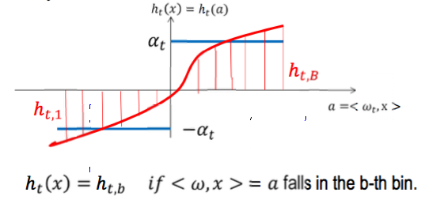{width=50%}

* Let $b_t = b_t(x)$ be the index of the bin that $\langle w_t,x \rangle$ falls in the $t$-th weak classifier $h_t$. The output classifier becomes:
$$ F(x,\Theta) = h_{1,b_1(x)} + ... + h_{t,b_t(x)} $$ 
* That is, each weak classifier vote for $h_{1,b_1(x)}$ which is a real number (and contains more information than a binary one = more effective)
* How do we find $\theta_t = (h_{t,1}, ..., h_{t,b})$?
    * AdaBoost divides the space (the training set) into 2 subsets: (1) those that are classified correctly by $h_t$ and (2) those that are classified incorrectly by $h_t$.
    * RealBoost divides the space into B subsets (bins), for each bin $b = 1,2,...,B$.

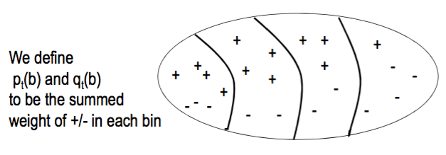{width=50%}

* We calculate the weights of positive ($p_t(b)$) and negative ($q_t(b)$) samples:
$$
\begin{aligned}
    p_t(b) &= \sum_{i=1}^m D(i) 1(y_i = +1)1(i \in Bin(b))\\
    q_t(b) &= \sum_{i=1}^m D(i) 1(y_i = -1)1(i \in Bin(b))
\end{aligned}
$$
* Therefore the criterion can be written as:
$$
\begin{aligned}
    Z_t(\theta_t) &= \sum_{x \in \Omega} \text{exp}(-y_i F(x_i;\theta))\\
                  &= \sum_{x \in \Omega} p_t(b(x_i)) e^{-h_{t,b(x_i)}} + q_t(b(x_i)) e^{h_{t,b(x_i)}}
\end{aligned}
$$
* In the above equations, $h_t(b)$ takes a real value and absorbs $\alpha_t$. We reformulate $Z$ slightly to sum over bins instead of over data points, combining the data points intp $p$ and $q$ according to their definitions (above):
$$ Z_t(\theta_t) = \sum_{b=1}^B p_t(b) e^{-h_t,b} + q_t(b) e^{h_{t,b}} $$
* minimize $Z_t$ by taking the derivative w.r.t $h_{t,b}$:
$$
\begin{aligned}
    \frac{\partial Z}{\partial h_{t,b}} &= -p_t(b)\text{exp}(-h_{t,b}) + q_t(b) \text{exp}(h_{t,b}) = 0 \\ 
        &\implies \log(p_t(b)) - h_{t,b} = \log(q_t(b)) + h_{t,b} \\
        &\implies h_{t,b} = \frac{1}{2}\log \frac{p_t(b)}{q_t(b)}
\end{aligned}
$$
* Plugging this into the definiton of $Z_t$ yields:
$$ Z = 2\sum_{b=1}^{B}\sqrt{p_t(b)q_t(b)} $$
* The RealBoost Algorithm:
    0) Initialize the data with uniform weight $\rightarrow D_0 = \frac{1}{m},~\forall X_i \in \Omega$. Set t = 0.
    1) Compute $p$ and $q$ for every weak learner
    2) Choose the weak learner with the lowest $Z$
    3) Update the weight of each data point:
    $$ D_t(x_i) = \frac{1}{Z_t} D_{t-1}(x_i)e^{-y_iH_{t,b(x_i)}} $$
    4) Continue from Step 2 until the convergence properties are met (the same as AdaBoost)

## LogitBoost
* RealBoost changed AdaBoost's hypothesis funtion. LogitBoost changes AdaBoost's loss function:
$$
\begin{aligned}
    \ell(\alpha,h) &= \log \prod_{i=1}^{m} p(y_i|x_i) \\
                   &= -\sum_{i=1}^{m} \log(1 + e^{-2y_i\langle \alpha,h(x_i)\rangle})
\end{aligned}
$$
* The rest of the derivation follows classical logistical regression.
* The two resulting loss functions are:
$$
\begin{aligned}
    \text{AbaBoost: } & (\alpha,h)^* = \text{arg}\underset{(\alpha,h)}{\text{min}} E_{p(x,y)}(-y\langle \alpha,h(x)\rangle ) \\
    \text{LogitBoost: } & (\alpha,h)^* = \text{arg}\underset{(\alpha,h)}{\text{min}} E_{p(x,y)}\left(\log(1+\text{exp}(-2\langle \alpha,h(x)\rangle ))\right)
\end{aligned}
$$
* Probabilistic Claim: for any probability distribution $p(x,y)$, both optimization problems have a minimum at:
$$ F(x) = \langle \alpha^*,h^*(x)\rangle = \frac{1}{2} \log \frac{p(y=+1|x)}{p(y=-1|x)} $$
This statement is proved by taking a derivative w.r.t. $F(x)$ to derive the minimum.

## Cascaded Classifiers
* Cascaded classifiers offer performance improvements by concentrating testing computation on data points which have a good chance of being classified as a positive data point. In practice, this is achieved by throwing away testing samples which have a high likelihood of being classified as a negative data point.

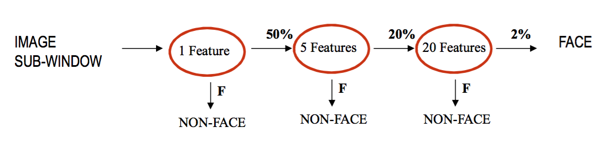{width=50%}

## Tree Structured Classification
* Intuitive idea: game of 20-questions. Build the shortest binary tree whose leaves are individual objects in a certain set. Has many applications in the natural world: plant classification, etc. 
* A **decicision tree** is a discriminative method that targest decision boundaries between classes. 
    * It is a supervised learning with greedy pursuit.
* Major components of tree structured classification:
    1) The criteria for splitting.
    2) The design of tests
    3) The rule for stopping and tree pruning.
    4) The rule for labeling leaves of the tree.
    5) Data validation, variable combination, and missing data strategy.

* The **criteria for splitting** a leaf node is to make the population of the samples in the children nodes purer than the current leaf. Given a node $t$ in the tree $T,~p(j|t);~j=1,2,...,k$ is the proportion (probability) of training samples labeled $j$ in $t$. 
* There are two typical choices for entropy:
    1) The Shannon entropy:
    $$ i(t) = - \sum_{j=1}^{k} p(j|t) \log(j|t) $$
    2) The Gini-index:
    $$ i(t) = 1 - \sum_{j=1}^{k} p(j|t)^2 $$
* The impurity of the entrie tree (total entropy) is the weighted sum of the impurities of its leaves.
$$ I(T) = \sum_{t \in L(T)} i(t)p(t) $$ 
where $L(T)$ is the set of all leaves in the tree $T$ and $p(t)$ is the proportion of the training samples in $t$ (ie.e. the more examples are in a leaf, the heavier the weight it has). *When this impurity is zero, then the empirical (training) error is also zero.*
* To build a classification tree, we start with one root node as the leaf including all the training examples. Each time we choose to split one leaf node $t$ by a certain test $s$ so that the impurity of the tree decreases the most.
$$ \Delta i(s,t) = i(t) - \sum_{j=1}^{k} p(j) i(t_j) $$
* To design $s$: we can't enumerate all possibilities. But we can make each test designed for a single feature. Thus, as we continue testing and splitting on different features, we get a partition of the training data. These tests could be categorial (binary) or continuous.
* Note: we don't want a leaf node to end up with just one training example in it, so we may stop at the leaf node above, and take the majority of the training examples there.
* Decision trees may be fed as weak classifiers to AdaBoost.

## Syntactic Pattern Recognition
* Patterns are represented by a vector of features, and pattern recognition is to partition the space. 
* This scheme is also used in the tree-structured classification.

### Grammar-based Methods
* Basic idea: use grammars for pattern recognition, use parsing algorithms from compiler theory to recognize patters.
* A **grammar** is often written as a quadruple: $G = \langle V_N,V_T,R,s\rangle$, where $V_n$ is a set of non-terminal nodes, $V_T$ is a set of terminal nodes, $R$ is a set of production rules, and $s$ is an initial node.
* A sentence or string $w$ is valid if it can derived by production rules in finite steps:
* The set of all valid sentences or strings is called its language.
* Types of grammars:
    1) Finite-state grammar (finite state automation): All rules are of the form $A \rightarrow aB$ or $A \rightarrow B,~a,b \in V_T,~A,B \in V_N$. Corresponds to Markov Models.
    2) Context-free grammar: All rules are of the form $A \rightarrow \beta ,~\beta \in (V_T \cup V_N)^+,~ A \in V_N$. Markov tree models and branching processes.
    3) Context-sensitive grammar: All rules of the form $\xi_L A \xi_r \rightarrow \xi_L \beta \xi_R,~\beta \in (V_T \cup V_N)^+,~A \in V_N$. Here a node is expanded depending on the preceding symbols.
    4) General grammar: no limitations on its production rules. It is believed natural languages belong here. 
* **Stochastic grammars** are a 5-tuple: $\langle V_N, V_T, R, p, \Sigma\rangle$ where $\Sigma$ is the set of valid sentences and $p$ is a probability metric on sequences.
* A sentence can have multiple valid parses, weighted by probabilities: $A_i \rightarrow \beta_1;p_{i1}, A_i \rightarrow \beta_2;p_{i2}, ...$
* Typical parsing algorithms in NLP:
    1) Pure bottom-up (CYK - chart parsing)
    2) Pure top-down (Earley-parser)
    3) Recursive/iterative (Inside-outside algorithm)
    4) Heuristic (Best-first chart parsing)

# Linear Classifiers
* Again, a 2-class classification problem in $n$-dimensional feature space. 
* Basic idea: Learn a hyperplane which separates the data points. We then compare the data points to the hyperplane for classification
$$ 
\begin{aligned} 
    g(x) &= \langle \text{\textbf{w}},\text{\textbf{x}}\rangle + b \\
         &= \sum_{i=1}^{n} w_ix_i + b
\end{aligned}
$$ 
where **w** is a weight vector, **x** is the data point, and **b** is the bias term. So $g(x;\text{\textbf{w}},\text{\textbf{b}}) = 0$ is a hyperplane, $H$, in $\mathbb{R}^n$
* The final classifier is $f(x) = \text{sign}\{g(x;\text{\textbf{w}},\text{\textbf{b}})\}$

## Percpetron
* Basic idea: learn the optimal hyperplane iteratively.
* If the data are linearly seperable, the algorithm will converge. 
* Given a set of training samples: $D = \{(x_i, y_i): i =1,2,...,m\}$. For a hyperplane $H = \left( \frac{W}{||W||},\frac{b}{||W||}\right)$ the "functional" margin of an example is $(x_i, y_i)$ is:
$$ 
\begin{aligned}
    \gamma_i &= y_i g(x_i) = y_i(\langle w,x_i\rangle + b_i) \\
             &\implies \begin{cases}
                    \gamma_i > 0~~\text{if }g(x_i)\text{ and }y_i\text{ have the same sign (classified correctly)}\\
                    \gamma_i < 0~~\text{if classified incorrectly}
                \end{cases}
\end{aligned}
$$
* The **geometric margin** considers this margin over the entire data set w.r.t. $H$:
$$ \gamma_{(H,D)} = \underset{i}{\text{min}}~\gamma_i = \underset{i}{\text{min}}\left\{ y_i\left(\langle\frac{w}{||W||} ,x_i\rangle + \frac{b}{||W||}\right) \right\} $$
* The margin of data set $D$ is the maximum geometric margin over all hyperplanes $H$,
$$ \gamma_{(D)} = \underset{H}{\text{max}}~\gamma_{(H,D)} = \underset{H}{\text{max}}\left\{\underset{i}{\text{min}}\left\{ y_i\left( \langle \frac{w}{||W||} ,x_i \rangle + \frac{b}{||W||}\right) \right\} \right\}$$
* $D$ is "linearly separable" iff the margin of $D$ is postive, $\gamma_{(D)} > 0$.
* The emerpical error of a hyperplane is:
$$ \text{Err} = \frac{1}{m}\sum_{i=1}^{m} 1(\gamma_i < 0) $$

### Learning the hyperplane by gradient descent
* Suppose $D$ is linearly separable, we need to learn a hyperplane that can separate it. We define an objective function, summing over all misclassified points:
$$ J(H,D) = \sum_{i:\gamma_i<0}-\gamma_i = \sum_{\gamma_i} -y_i(\langle w, x_i\rangle + b) $$ 
* Define the set of error points as: $\epsilon(t) = \{(x_i,y_i): \gamma_i < 0\}$.
* $J = 0$ iff all the margins are larger than 0.
* We minimize $J$ by gradient descent:
$$ 
\begin{aligned}
    \frac{\partial J}{\partial w} &= \sum_{i:\gamma_i < 0} y_i x_i \\
    \frac{\partial J}{\partial b} &= \sum_{i:\gamma_i < 0} y_i
\end{aligned}
$$
* From these we derive the update rules for the perceptron:
$$ 
\begin{aligned}
    w &\leftarrow w + \eta y_i x_i \\
    b &\leftarrow b + \eta y_i R^2
\end{aligned}
$$
where $\eta$ is a learning rate, $R^2$ is the scale of the data ($\text{max}_i ||x_i||^2$)
* Repeat this learning procedure until all of the data points are correctly classified by the linear separator ($\epsilon(t) = \{(x_i,y_i): \gamma_i \leq 0\} = 0$)
* The final perceptron:
$$
\begin{aligned}
    g(x) &= \langle w, x \rangle + b~~~~~~~~~~~~~~~~~&\text{Primal form} \\
         &= \sum_{i=1}^{m}\alpha_i y_i \langle x_i, x \rangle + \sum_{i=1}^{m} \alpha_i y_i R^2 &\text{Dual Form} 
\end{aligned}
$$
where $\alpha_i = \sum_{t =1}^{T} 1(\gamma_i \leq 0)$ is the number of times that a point is misclassified in the learning process. A larger number means more contribution to the final hyperplane. 

## Support Vector Machine Background
* Linear classification in high-dimensional space gives non-linear boundary in the original feature space, and thus a hyperplane is capable of generating complex decision boundaries.

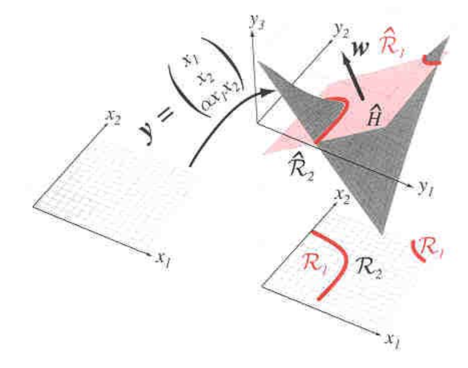{width=50%}

* Basic idea: map the data into a higher dimension using a kernel. Instead of finding a valid hyperplane (as in the case of perceptrons), we seek to maximize the margin of separation.
* Define the mapping function:
$$ 
\begin{aligned}
    \phi(x) &= \mathbb{R}^n \rightarrow \mathbb{R}^N \\
    x &= (x_1, x_2, ..., x_n) \rightarrow \phi(x) = (\phi_1(x),...,\phi_N(x))
\end{aligned}
$$
* The hyperplane in the mapped feature space is:
$$ g(x) = \sum_{j=1}^{N} w_j \phi_j(x) + b = \langle w,\phi(x) \rangle + b $$
Following the perceptron algorithm, we have the dual form:
$$ g(x) = \sum_{i=1}^{N} \alpha_i y_i \langle \phi(x_i), \phi(x) \rangle + b $$
* A **kernel** is a function mapping $\mathbb{R}^n x \mathbb{R}^n \rightarrow \mathbb{R}: K(x,x') = \langle \phi(x), \phi(x') \rangle$
    * The kernel means we don't have to know:
        1) The features $\phi_1(x),...,\phi_N(x)$ explicity
        2) The dimension $N$ (the dimension to map to)
    * All we care about is the final inner product; the computational complexity is independent of $N$.
* Mercer's Theorem
    * Suppose we don't design $\phi(x)$ explicitly, what properties ensure $K(x,x')$ is a "kernel"?
        1) $K(x,x')$ must be symmetric: $K(x,x') = \langle \phi(x), \phi(x') \rangle = \langle \phi(x'), \phi(x) \rangle = k(x',x)$
        2) Construct a **Gram matrix** for a finite set $D = \{(x_i,y_i): i = 1,...,m\}$ as $G=(K_{ij})_{mxm}\text{ with } K_{ij} = K(x_i,x_j))$.
    * **Mercer's Theorem**
        * $K(x,x')$ is a kernel iff the matrix $G$ is positive semi-definite (diagonizable). Which means $K(x,x')$ can be written as $$ K(x,x') = {\sum_{j=1}^{\infty}\lambda_j \phi_j(x) \phi_j(x') }$$
* In the practice of object recognition, people rarely use kernel functions for multiple reasons:
    1) Given the input image $x=I$, one can extract a large number of intuitive features, while the kernel is less intuitive (black box!)
    2) The kernel function makes the computation hard: $K()$ is computed for every data point (or each support vector)

## Support Vector Machines
* SVMs are a family of algorithms that seek hyperplanes using a different criterion than a perceptron (which sums over the margins of all mis-classified points).
    * SVMs find $H$ s.t. the data has the maximal margin
* Advantages of SVMs:
    1) Maximizing the margin will lead to better hyperplanes.
    2) We can relax the constraint that the data is linearly separable.
* We scale the hyperplane $H$ so that its functional margin is always 1, making its geometric margin $\frac{1}{||w||}$
* We want to minimize $||w||$ subject to the constraint that the data points are classified correctly:
$$
\begin{aligned}
    w^* &= \text{argmin}\langle w,w \rangle \\
    \text{Subject to } & -y_i(\langle w, x_i \rangle + b) + 1 \leq 0;~ i = 1...m
\end{aligned}
$$

* We can use a Lagrange mulitpliers to solve for $w^*$:
$$ w^* = \underset{w}{\text{min}} L(w,\alpha,\beta) = f(w) + \sum_{i=1}^{k}\alpha_i g_i(w) + \sum_{i=1}^{m} \beta_i h_i(w)$$
$$ \alpha = (\alpha_1,...\alpha_k),~\beta=(\beta_1,...,\beta_m)~~~\text{are the Lagrange mutlipliers}$$

* **Kuhn-Tucker Theorem**: for any Lagrangian $L(w,\alpha,\beta)$, if $f(w)$ is convex w.r.t. $w$, $g_i(w)$ and $h_i(w)$ are affine (i.e. of the form $g(w)$ or $h(w) = Aw+b$), then the sufficient and necessary conditions for $w^*$ are the existence of $\alpha^*$ and $\beta^*$ s.t.:
    1) $\frac{\partial L(w^{*},\alpha^{*},\beta^{*})}{\partial w} = 0$
    2) $\frac{\partial L(w^{*},\alpha^{*},\beta^{*})}{\partial \beta} = 0$
    3) $\alpha^{*} g_i(w^{*}) = 0 \text{ for all } i = 1,...,k$
    4) $g_i(w^{*}) \leq 0 \text{ for all } i = 1,...,k$
    5) $\alpha_i \geq 0 \text{ for all } i = 1,...,k$
* Two interesting properties:
    1) $\alpha_i = 0$ if $g_i(w) < 0 \implies$ "Inactive"
    2) $\alpha_i > 0$ if $g_i(w) = 0 \implies$ "Active"
    * From K-T point 3, we see that $alpha_i = 0$ or $g_i(w^*) = 0$. For the case where $\alpha_i = 0$ (or close to 0), this greatly reduces the computation of the SVM. We don't have to compute every $g_i(W)$ (there's one for every data point), we only have to worry about ones where $\alpha_i \neq 0$. These are the points which are close the the hyperplane. Basically, data points which are far from the hyperplane are "deactivated" sice we are confident about their classification.
* The **Maximal margin classifier** can be written in Lagrangian:
$$ L(\underbrace{w,b}_{\text{primal}},\underbrace{\alpha}_{\text{dual}}) = \frac{1}{2} \langle w,w \rangle - \sum_{i=1}^{m} \alpha_i [y_i(\langle w, \vec{x_i} \rangle + b) - 1]
 $$
* According to the Kuhn-Tucker Theorem, we solve for the prima variables by:
$$
\begin{aligned}
    \frac{\partial L}{\partial w} &= 0 \implies w = \sum_{i=1}^{m} \alpha_i y_i \vec{x}_i \\
    \frac{\partial L}{\partial b} &= 0 \implies \sum_{i=1}^{m} \alpha_i y_i = 0
\end{aligned}
$$
* Using these Lagrangian constraints we get:
$$
\begin{aligned}
    L(w,b,\alpha) &= \frac{1}{2} \langle \vec{w},\vec{w} \rangle - \sum_{i=1}^{m} \alpha_i [y_i(\langle w, \vec{x_i} \rangle + b) - 1] \\
                  &= \frac{1}{2} \langle \sum_{i=1}^{m} \alpha_i y_i \vec{x}_i,\sum_{i=1}^{m} \alpha_i y_i \vec{x}_i \rangle - \sum_{i=1}^{m} \alpha_i y_i \left( \langle \sum_{j=1}^{m} \alpha_j y_j \vec{x_j}, \vec{x_i} \rangle \right) - \sum_{i=1}^{m} \alpha_i y_i b + \sum_{i=1}^{m}\alpha_i \\ 
                  &= \frac{1}{2} \sum_{i=1}^{m} \sum_{j=1}^{m} \alpha_i \alpha_j y_i y_j \langle \vec{x_i}, \vec{x_j} \rangle - \sum_{i=1}^{m} \alpha_i y_i \left( \sum_{j=1}^{m} \alpha_j y_j \langle \vec{x_j}, \vec{x_i} \rangle \right) - \sum_{i=1}^{m} \alpha_i y_i b + \sum_{i=1}^{m}\alpha_i \\
\end{aligned}
$$
* The final dual form is: 
$$ Q(\alpha) \overset{\text{def}}{=} \sum_{i=1}^{m} \alpha_i - \frac{1}{2} \sum_{i=1}^{m}\sum_{j=1}^{m} \alpha_i \alpha_j \underbrace{y_i y_j \langle \vec{x_i},\vec{x_j} \rangle}_{\text{known constants}}$$

* From the final dual form we solve $\alpha^* = \text{argmin}~Q(\alpha)$ to find the optimal $w^*$ and $b^*$:
$$ 
\begin{aligned}
    w^* &= \sum_{i=1}^{m} \alpha_i y_i \vec{x_i} \\
    b^* &= - \frac{\underset{y_i=-1}{\text{max}}(\langle w^*, x_i \rangle) + \underset{y_i=+1}{\text{max}}(\langle w^*, x_i \rangle)}{2}~~\text{by definition}
\end{aligned}
$$
note that most of the $\alpha_i = 0$, which gives us a compact representation of $w$.
* The **support vectors** are the data points which lie on the two hyperplanes:
$$
\begin{aligned}
    SV &= \{\langle x_i,y_i \rangle : y_i(\langle w^*, x_i \rangle + b) = 1\} \\
    w^* &= \sum_{i \in SV} \alpha_i y_i \vec{x_i}
\end{aligned}
$$
    * Only the support vectors contribute to $w^*$ instead of the massive $m$ (all the data points).
* Recall: the perception solution, $w^* = \sum_{i \in SV} \alpha_i y_i \vec{x_i}$ is the same, but it is an iterative solution for $\alpha$.

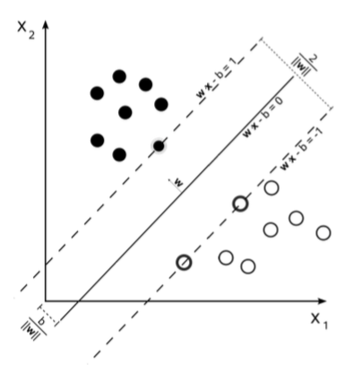{width=50%}

### SVM Summary
* The maximal margin classifier leads to a hyperplane in two forms:
$$
\begin{aligned}
    g(x : w,b) &= \langle w,x \rangle + b~~~~&\text{(primal)} \\
    g(x : w,b) &= \sum_{i \in SV} \alpha_i y_i \langle x_i,x \rangle + b &\text{(dual)}
\end{aligned}
$$
* We can map this SVM to kernel induced spaced. Given $D = \{(x_i,y_i): i=1,...,m\}$ which is linearly separable in the feature space implicitly defined by a kernel $K(x,x')$. Suppose $\alpha^*, b^*$ solbes the quadratic maximization problem:
$$ \alpha* = \text{argmax}~ \sum_{i=1}^{m} \alpha_i - \frac{1}{2} \sum_{i=1}^{m}\sum_{j=1}^{m}\alpha_i\alpha_jy_iy_jK(x,x') $$
subject to: 
$\sum_{i=1}^{m} y_i \alpha_i = 0$ (from $\frac{\partial L}{\partial b} = 0$) and $\alpha_i \geq 0$ (from Kuhn-Tucker) 
* The decision rule becomes:
$$ H(x) = \text{sign}\left( \sum_{i=1}^{m} y_i \alpha_i K(x,x') + b^*\right) $$
which is equivlant to the max-margin hyperplane in the feature space. The max-maxgin hyperplane has the geometric margin:
$$ \gamma^* = \frac{1}{||w||_2} = \frac{1}{\sqrt{\sum_{i \in SV} \alpha_i}} $$

## Soft Margin SVMs
* The max-margin SVM is a simple SVM, a main drawback is the assumption the data is linearly separable. This leads to overfitting (when the data contains noise and the outliers are not linearly separable). We introduce a slack variable for each point to combat this.

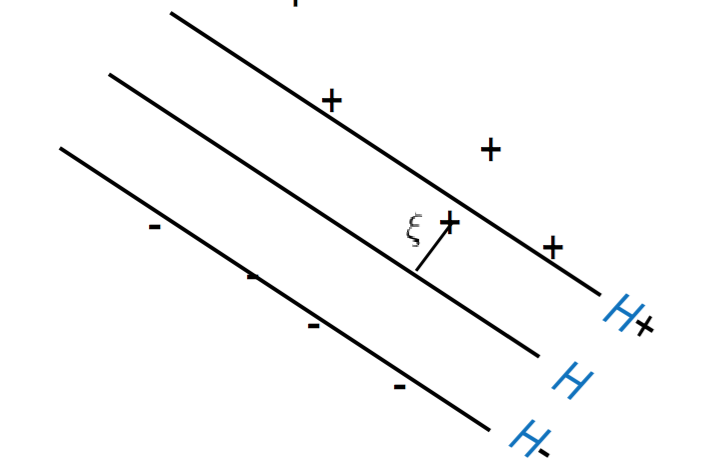{width=40%}

* With the slack parameter $\xi$, the criterion becomes:
$$ 
\begin{aligned}
    & \text{min} \langle w, w \rangle + c \sum_{i=1}^{m} \xi_i^2\\
    \text{subject to: } & y_i(\langle w, x_i \rangle + b) \geq 1 - \xi_i 
\end{aligned}
$$
    1) $\xi_i \geq 0$, the case of $\xi_i < 0$ is penalized by minimizing $\xi_i^2$
    2) Paramter $c$ is selected in a large range through cross validation for reaching small testing errors.
* The primal Lagrangian becomes:
$$ 
\begin{aligned}
    L(w,b,\xi,\alpha) &= \frac{1}{2}\langle w,w \rangle + \frac{c}{2}\sum_{i=1}^{m} \xi_i^2 - \sum_{i=1}^{m} \alpha_i (y_i(\langle w, x_i \rangle + b) - 1 + \xi_i) \\
    \frac{\partial L}{\partial w} &= 0 \implies \vec{w} = \sum_{i=1}^{m} y_i\alpha_i \vec{x_i} \\
    \frac{\partial L}{\partial \xi} &= 0 \implies c \xi = \alpha \\
    \frac{\partial L}{\partial b} &= 0 \implies \sum_{i=1}^{m} y_i \alpha_i = 0
\end{aligned}
$$
* The dual is obtained by pluggin in $w$:
$$
\begin{aligned}
    L(w,b,\xi,\alpha) &= \sum_{i=1}^{m} \alpha_i - \frac{1}{2}\sum_{i=1}^{m}\sum_{j=1}^{m} y_iy_j\alpha_i\alpha_j(\langle \vec{x_i}, \vec{x_j} \rangle - \frac{1}{2c} \langle \vec{\alpha}, \vec{\alpha} \rangle\\
    &= \sum_{i=1}^{m} \alpha_i - \frac{1}{2}\sum_{i=1}^{m}\sum_{j=1}^{m} y_iy_j\alpha_i\alpha_j(\langle \vec{x_i}, \vec{x_j} \rangle + \frac{1}{c} \delta_{ij} ~~~ \delta_{ij} = 1 \text{ if } i = j 
\end{aligned}
$$
Solving the dual problem w.r.t. $\alpha$:
$$ \underset{\alpha}{\text{min}}~L(\alpha) = \sum_{i=1}^{m} \alpha_i - \frac{1}{2}\sum_{i=1}^{m}\sum_{j=1}^{m} y_i y_j \alpha_i \alpha_j \left( K(x,x') + \frac{1}{c} \delta_{ij} \right) $$
* The new geometric margin becomes:
$$ \gamma^* = \frac{1}{||w^*||_2} = \frac{1}{\sqrt{\sum_{i \in SV}\alpha_i^* - \frac{1}{c}\langle \alpha^*, \alpha^* \rangle}} $$

# Learning Models

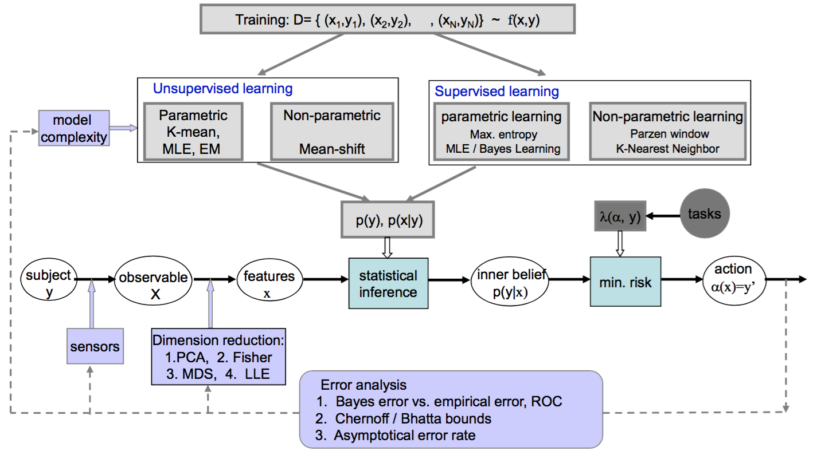{width=70%}

* Objective: learning the prior and class models, both the *parameters* and the *formulations (forms)* from training data for classification.
* Terminology:
    1) **Supervised Learning**: data are labeled manually for training
    2) **Unsupervised Learning**: the computer discovers the number of class, and labels the data to estimate the class models in an iterative way.
    3) **Circulum Learning**: training the computer is done by order of the sophsication, you build up to high-level knowledge, starting with basic conepts.
    4) **Parametric Learning**: the probbility model is specified by a number of parameters with a more or less fixed length (e.g. the Gaussian distribution)
    5) **Non-parametric Learning**: The probility model is dependent on the samples themselves. If we thread them as parameters, the number of parameters often increases linearly with the size of the training set.

## Max Likelihood Estimation
* Basic assumptions: 
    1) There is an underlying frequency $f(x,y)$ for variables $x$ and $y$ jointly. The training data are samples from $f(x,y)$.
    2) We assume that we know the probability family for $p(x|y=i),~i=1,...,k$. Each family is specified by a vector valued parameter $\theta$. This means MLE is a *parametric method*.
    3) The different class of models can be learned independently. E.g. there is no correlation between salmon and sea bass in the training data.
* Given: data $D = \{(x_1,c_1),...(x_N,c_N)\}$ as independent samples from $f(x)$ for a class $w_i$.
* Goal: esitimate (learn) the prior ($p(y=i)$) and conditional probabilities ($p=(x|y=i),~i=1,2,...,k$) as an estimation of $f(x)$
* Formulation: We choose $\theta$ to minimize a "distance measure" between $f(x)$ and $p(x;\theta)$
$$ \theta^* = \text{arg}\underset{\theta \in \Omega_\theta}{\text{min}} \int f(x) \log \frac{f(x)}{p(x;\theta)} dx $$
* This is called the Kullback-Leibler divergence, formally defined as:
$$ 
\begin{aligned}
    KL(f||p) &= \int f(x) log \frac{f(x)}{p(x;\theta)} dx\\
             &= E_f(\log f(x)) - E_f (\log p(x;\theta))
\end{aligned}
$$
So, we can formulate $\theta^*$ as:
$$ 
\begin{aligned}
    \theta^* &= \text{arg}\underset{\theta \in \Omega_\theta}{\text{min}}~ \int f(x) \log \frac{f(x)}{p(x;\theta)} dx \\
             &= \text{arg}\underset{\theta \in \Omega_\theta}{\text{min}}~ KL(f||p) \\ 
             &= \text{arg}\underset{\theta \in \Omega_\theta}{\text{min}}~ E_f(\log f(x)) - E_f (\log p(x;\theta)) \\
             &= \text{arg}\underset{\theta \in \Omega_\theta}{\text{max}}~ E_f (\log p(x;\theta)) \\ 
             &= \text{arg}\underset{\theta \in \Omega_\theta}{\text{max}}~ \sum_{i=1}^{N} \log p(x_i;\theta)
\end{aligned}
$$
Where $E_f$ is the expectation of $f(x)$. This is the optimal criterion because by minimizing the KL-divergence, we minimize the difference between the proposed probability distribution and the actual probability distribution.
* We can approximate the sample mean with the expectation:
$$ E_f \approx \frac{1}{m} \sum_{i=1}^{m} \log p(x_i;\theta) + \epsilon$$ 
with $\epsilon$ on the order of $O(\frac{c}{m})$, so as the data set grows, $epsilon$ appraches 0.
* We denote the log-likelihood function to be:
$$ \ell(\theta) = \sum_{i=1}^{N} \log p(x_i;\theta) $$
and compute $\theta^*$ with:
$$ \frac{d\ell(\theta)}{d\theta} = 0 $$

###MLE Summary
* MLE computes one point in the probability family $\Omega_\theta$.
* There are 3 interpretations of MLE:
    1) Minimize the KL-divergence (information theory perspective)
    2) Maxmimize the log-likelihood $\ell(\theta) = \sum_{i=1}^{N} \log p(x_i;\theta)$ minimize loss $L(\theta)$), statistics perspective
    3) Minimum coding length, computer science perspective

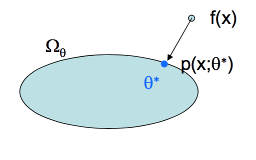{width=20%}

* It treats $p$ as a quantity. The problems are:
    1) Does not incorporate general loss, loss is only in terms of how well it explains the data
    2) It is difficult to integrate with new data incrementally (e.g. if new data arrives after MLE, how do we update $p$?).
    3) It is a point estimate, it does not preserve the full uncertainty (e.g. there could be multiple peaks, each valid $\theta^*$).

## Bayes Learning
* Bayes learning addressed the point estimatation problem by treating $\theta$ as a random variable (and so it estimates a probability distribution of $\theta$). We denote the class probability $p(x|\theta)$ (constrast to $p(x;\theta)$). Instead of computing a single $\theta^*$, we compute the posterior probability from $D$. Since the samples in $D$ are independent, we have:
$$ p(\theta|D) = \frac{p(D|\theta)P(\theta)}{p(D)} = \prod_{i=1}^{N} \frac{p(x_i|\theta)p(\theta)}{p(D)} $$

### Recursive Bayes Learning
* Suppose we observe a new data set $D^{new} = {x_{N+1},...,x_{N+M}}$ after learning the posterior proability $p(\theta|D)$, we can treat $p(\theta|D)$ as our prior model and compute:
$$ 
\begin{aligned}
    p(\theta|D^{new},D) &= \frac{p(D^{new}|\theta,D)P(\theta|D)}{p(D^{new})} \\
                        &= \prod_{i=N+1}^{M} \frac{p(x_i|\theta)p(\theta|D)}{p(D^{new})} \\
                        &= \prod_{i=1}^{N+M} \frac{p(x_i|\theta)p(\theta)}{p(D^{new},D)}
\end{aligned}
$$
* This is an iterative learning procedure; you start with a non-iformative or uniform Bayesian prior probabilities and as more samples are observed, the distribution becomes more contoured, less uniform, with lower variance.
* Eventually the Bayesian Estimate converges on the MLE as the number of data points grows.

## Parzen Windows and K-Nearest Neighbor
* Need to actually study and didn't have time to convert these into proper notes, but these are directly from the course slides.

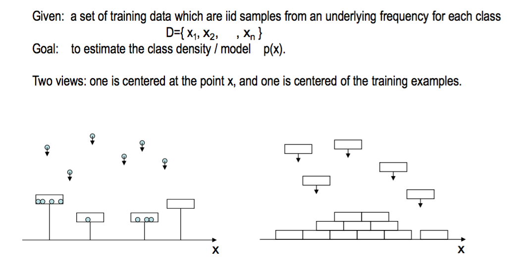{width=70%}

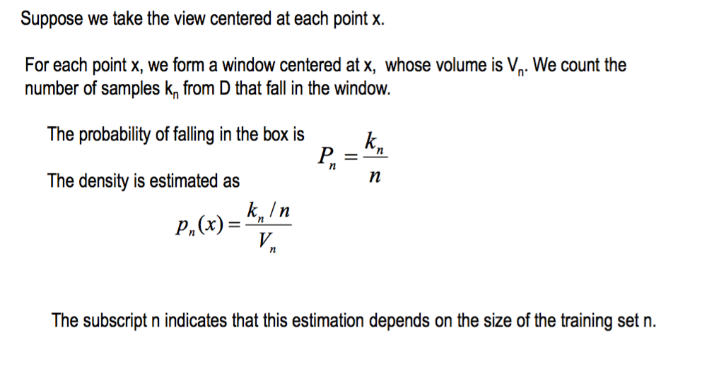{width=70%}

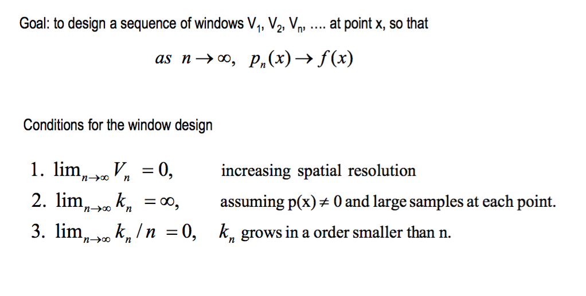{width=70%}

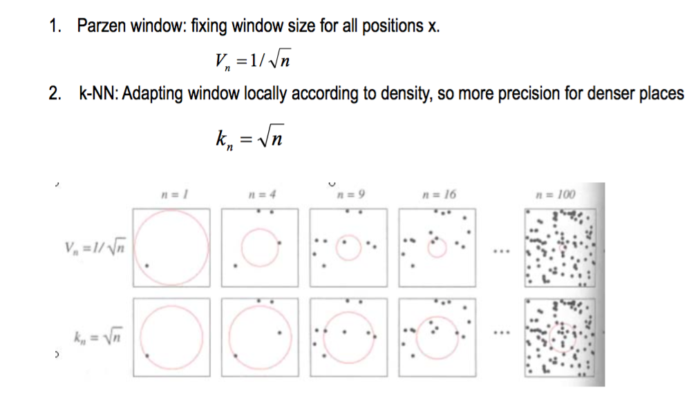{width=70%}
